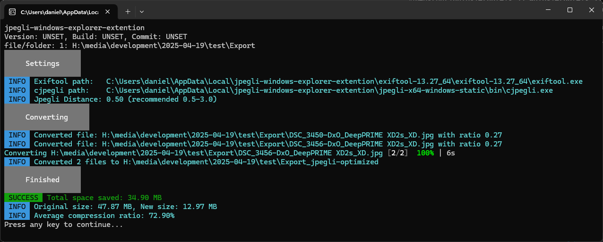
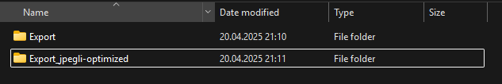
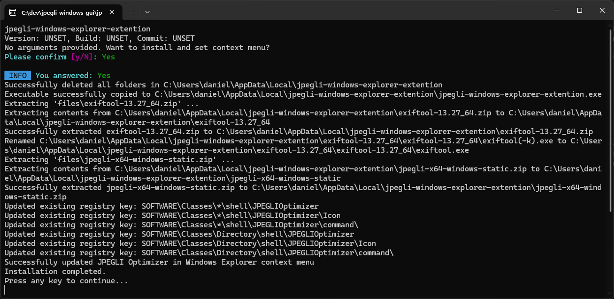
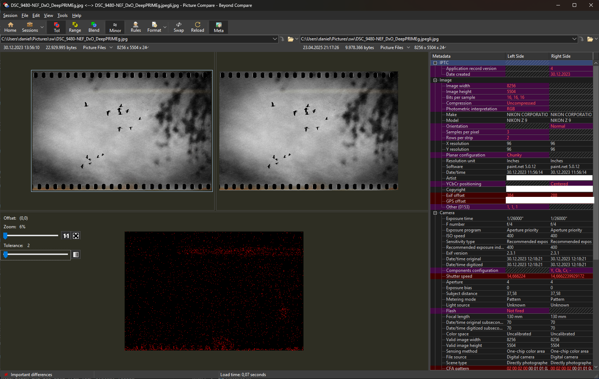

[](https://github.com/dhcgn/jpegli-windows-explorer-extension/actions/workflows/go.yml)

# JPEG Optimizer for Windows with jpegli

> ⚠️⚠️⚠️ Very early version under active development ⚠️⚠️⚠️

This is a command-line application written in Go for optimizing JPEG image files using the jpegli optimizer. 

**How to Use:**
- **No arguments:** Run the executable without any arguments to install itself as a Windows Explorer context menu entry. This lets you optimize JPEGs directly from the right-click menu on files or folders.
- **One argument:** Run the executable with a single argument (either a file or a folder) to optimize JPEGs in that location immediately.

This simple interface makes it easy to use the tool directly, automate it in scripts, or integrate it into other applications.

## About jpegli

> **WARNING:** jpegli is an experimental technology and is NOT production ready. Everything you do with this tool is at your own risk!

jpegli is a new JPEG coding library developed by Google Research that maintains high backward compatibility while offering enhanced capabilities and a 35% compression ratio improvement at high quality compression settings.

Key features of jpegli include:
- Full interoperability with the original JPEG standard
- Higher quality results with fewer artifacts
- Comparable coding speed to traditional approaches like libjpeg-turbo and MozJPEG
- Support for 10+ bits per component (while maintaining compatibility with 8-bit viewers)
- More efficient compression than traditional JPEG codecs

For more information, see: [Introducing Jpegli: A New JPEG Coding Library](https://opensource.googleblog.com/2024/04/introducing-jpegli-new-jpeg-coding-library.html)

## Screenshots

### Demo





### Installation



## Purpose

This CLI application provides a simple way to optimize JPEG files or entire folders using the jpegli optimizer, while preserving image metadata through exiftool. The application can be invoked directly from the command line or via the Windows Explorer context menu after installation.

## Key Features

1. **Context Menu Integration**
   - When run without arguments, the app installs itself as a Windows Explorer context menu entry for both files and folders.
   - After installation, you can right-click any file or folder to optimize JPEGs using the context menu.

2. **Drag and Drop & CLI Usage**
   - You can run the app from the command line, passing a file or folder as an argument to optimize JPEGs.

3. **Optimization Settings**
   - Uses a default distance (quality) setting for jpegli, which can be adjusted in the config file.
   - Preserves metadata using exiftool.

4. **Embedded Tools**
   - Both jpegli.exe and exiftool.exe are embedded within the application and extracted as needed. No manual download is required.

## Example Workflow

- Run the executable without arguments to install the context menu integration.
- Right-click a file or folder in Windows Explorer and select "Optimize JPEGs with JPEGLI".
- Or, run the executable from the command line with a file or folder as an argument to optimize JPEGs.

## Recommended Usage

For best results, export your images from Lightroom, Capture One, or other photo applications using JPEG format with quality set to 100%. Then, use this CLI tool to optimize the exported JPEGs. While the tool also supports other file formats (such as PNG, GIF, JXL, etc.), metadata preservation is most reliable and fully supported for JPEG files.

This workflow ensures you retain the highest image quality and complete metadata when optimizing your photos.

## Dependencies

The application embeds:
- jpegli.exe - The core optimization engine provided by Google jpegli-Project https://github.com/google/jpegli.
- exiftool.exe - For preserving image metadata

No manual setup of these tools is required.

For those who prefer scripting, the included PowerShell script `convert_with_jpegli.ps1` demonstrates how to perform the same optimization using a script with these executables directly.

## Configuration

The application supports configuration via a YAML file located at:

If the file does not exist, the application will automatically create it with default settings the first time it runs.

```
C:\Users\%USER%\AppData\Local\jpegli-windows-explorer-extension\config.yaml
```

### Open with Notepad with PowerShell or CMD command

#### PowerShell

```powershell
start "C:\Users\${env:USERNAME}\AppData\Local\jpegli-windows-explorer-extension\config.yaml"
```

#### CMD

```cmd
notepad "%LOCALAPPDATA%\jpegli-windows-explorer-extension\config.yaml"
```

### Sample config.yaml

The default settings are set to ensure high quality!

```yaml
distance: 0.5
```

- `distance`: Controls the jpegli quality setting. Lower values mean higher quality (recommended range: 0.5–3.0, where 1.0 is visually lossless).

You can edit this file to adjust the optimization settings to your preference.

## Controll Quality

I recommend using https://www.scootersoftware.com/ to compare the original and optimized images. This tool allows you to view the images side by side and adjust the tolerance to see the differences clearly.



## Uninstallation

To completely remove the JPEGLI Optimizer integration and its data from your system, follow these steps:

1. **Run the provided PowerShell script**

   The repository includes a script at `_scripts/deinstall.ps1` that will:
   - Remove the Windows Explorer context menu entries for both files and folders.
   - Delete the application's data folder from your user profile (`%LocalAppData%\jpegli-windows-explorer-extension`).

2. **How to run the script**

   Open a PowerShell window and execute:

   ```powershell
   & "<path-to-repo>\_scripts\deinstall.ps1"
   ```
   Replace `<path-to-repo>` with the actual path to your cloned repository.

3. **What the script does**

   - Removes registry keys:
     - `HKCU:\SOFTWARE\Classes\*\shell\JPEGLIOptimizer`
     - `HKCU:\SOFTWARE\Classes\Directory\shell\JPEGLIOptimizer`
   - Deletes the app data folder:
     - `%LocalAppData%\jpegli-windows-explorer-extension`

After running the script, the app and its Explorer integration will be fully removed from your system.